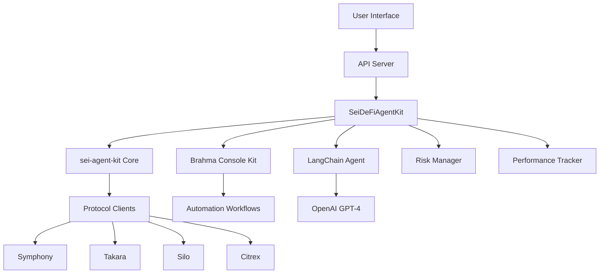
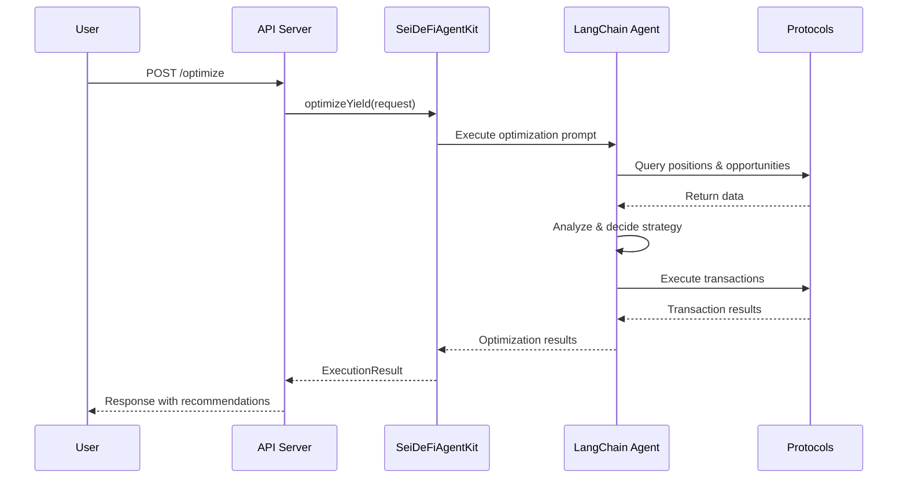
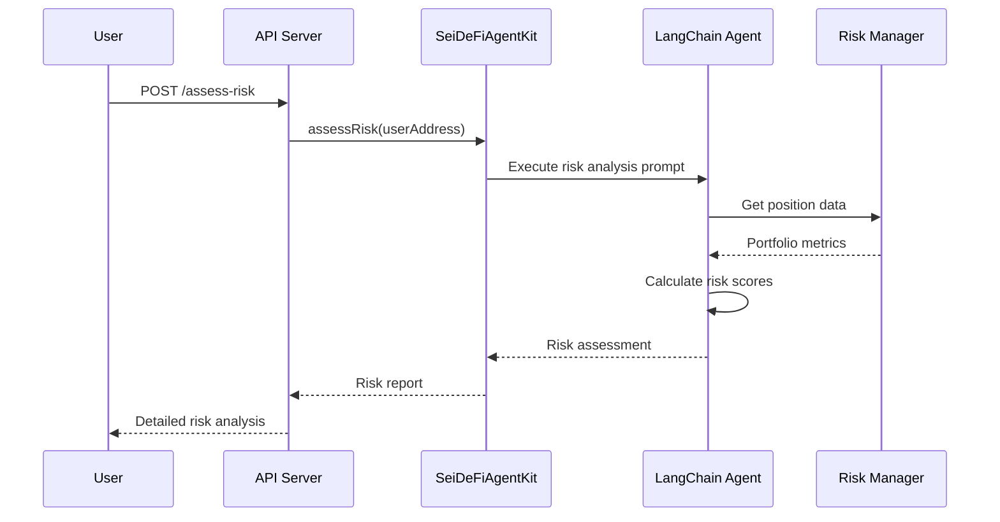
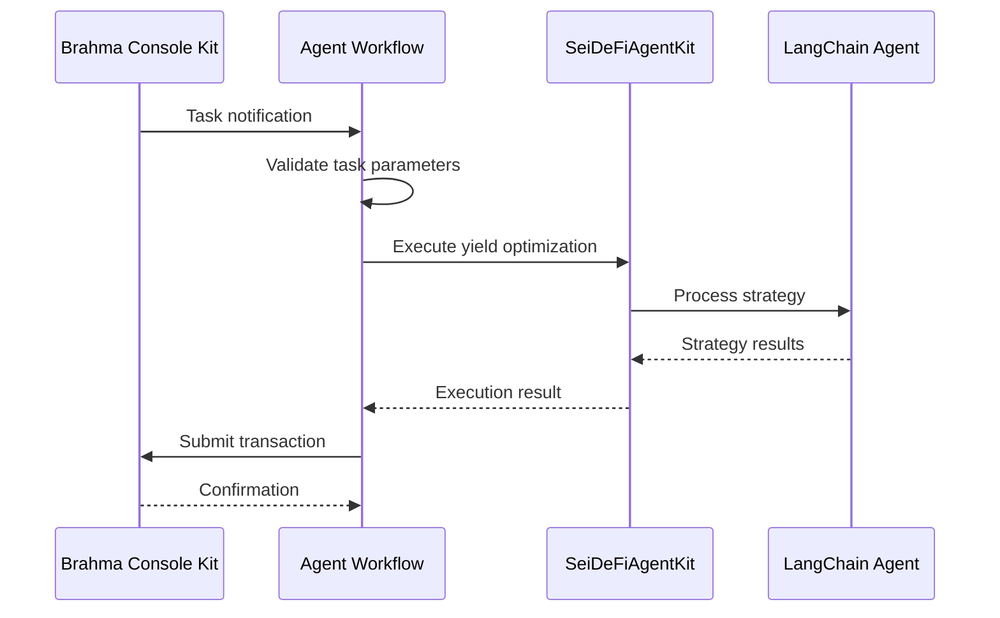
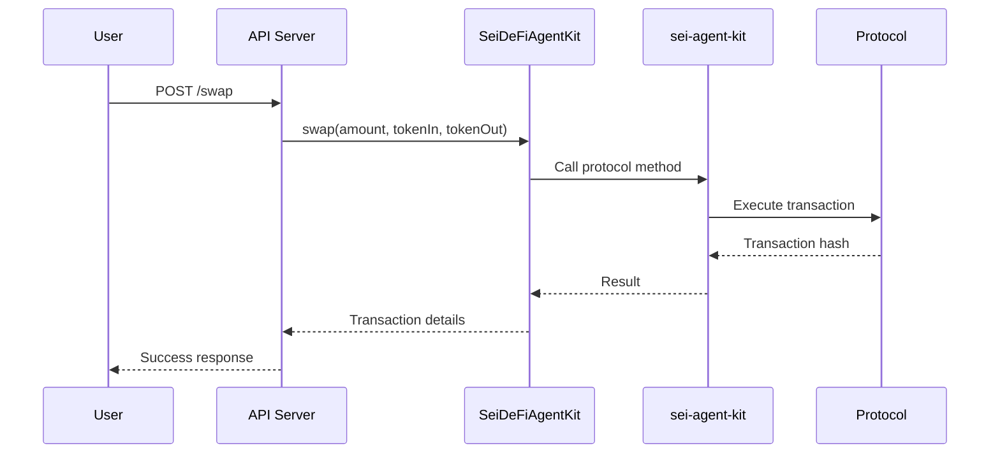

# Sei DeFi Agent Documentation

Welcome to the Sei DeFi Agent - an AI-powered automation system for DeFi operations on the Sei blockchain using the sei-agent-kit.

## Table of Contents

1. [Overview](#overview)
2. [Architecture](#architecture)
3. [User Flows](#user-flows)
4. [Installation & Setup](#installation--setup)
5. [Configuration](#configuration)
6. [API Reference](#api-reference)
7. [Protocol Integrations](#protocol-integrations)
8. [AI Features](#ai-features)
9. [Security](#security)
10. [Troubleshooting](#troubleshooting)

## Overview

The Sei DeFi Agent is a comprehensive automation system that leverages artificial intelligence to optimize DeFi operations on the Sei blockchain. It integrates with multiple protocols including Symphony, Takara, Silo, and Citrex through the sei-agent-kit, providing users with intelligent yield optimization, risk management, and automated trading strategies.

### Key Features

- **AI-Powered Yield Optimization**: Uses OpenAI GPT-4 to analyze and optimize yield opportunities
- **Multi-Protocol Integration**: Works with Symphony, Takara, Silo, and Citrex protocols
- **Risk Management**: Automated risk assessment and portfolio rebalancing
- **Real-time Monitoring**: Performance tracking and trade history
- **Brahma Console Kit Integration**: Enterprise-grade automation workflows
- **RESTful API**: Complete HTTP API for all operations
- **Emergency Controls**: Circuit breakers and emergency stop functionality

## Architecture

### System Components



### Core Components

1. **SeiDeFiAgentKit**: Main orchestration layer that coordinates AI, protocols, and automation
2. **sei-agent-kit**: Unified SDK for Sei DeFi protocol interactions
3. **LangChain Integration**: AI agent framework with tool execution capabilities
4. **Brahma Console Kit**: Enterprise automation and workflow management
5. **Protocol Clients**: Direct integrations with Sei DeFi protocols
6. **Risk Management**: Portfolio monitoring and risk assessment
7. **Performance Tracking**: Trade history and metrics collection

## User Flows

### 1. Yield Optimization Flow



### 2. Risk Assessment Flow



### 3. Automated Workflow Flow



### 4. Manual Protocol Interaction Flow



## Installation & Setup

### Prerequisites

- Node.js 18+ 
- OpenAI API key
- Sei wallet with private key
- Brahma Console Kit API key (for automation)

### Installation

```bash
# Clone the repository
git clone <repository-url>
cd sei-defi-agent

# Install dependencies
npm install

# Copy environment template
cp env.example .env

# Edit configuration
nano .env
```

### Environment Configuration

Required environment variables:

```bash
# Core Configuration
PRIVATE_KEY=your_wallet_private_key
OPENAI_API_KEY=your_openai_api_key
RPC_URL=https://evm-rpc.sei-apis.com

# Brahma Console Kit (for automation)
BRAHMA_API_KEY=your_brahma_console_api_key
REGISTRY_ID=your_registry_id
EXECUTOR_PRIVATE_KEY=your_executor_private_key
EXECUTOR_ADDRESS=your_executor_address

# Risk Management
MAX_POSITION_SIZE=10000
RISK_TOLERANCE=medium
MAX_SLIPPAGE=0.5
```

### Starting the System

```bash
# Development mode
npm run dev

# Production build
npm run build
npm start

# Run automation workflow
npm run run-agent
```

## Configuration

### Agent Configuration

The agent supports extensive configuration through environment variables:

#### Trading Parameters
- `MAX_SLIPPAGE`: Maximum slippage tolerance (default: 0.5%)
- `MIN_YIELD_THRESHOLD`: Minimum yield to trigger rebalancing (default: 5.0%)
- `REBALANCE_THRESHOLD`: Threshold for portfolio rebalancing (default: 2.0%)

#### Risk Management
- `RISK_TOLERANCE`: Risk tolerance level (low/medium/high)
- `MAX_POSITION_SIZE`: Maximum position size in base currency
- `MAX_PROTOCOL_EXPOSURE`: Maximum exposure to single protocol (default: 30%)
- `EMERGENCY_STOP_LOSS`: Emergency stop loss threshold (default: 10%)

#### Protocol Preferences
- `PREFERRED_PROTOCOLS`: Comma-separated list of preferred protocols
- `MAX_LEVERAGE`: Maximum leverage allowed (default: 3.0x)
- `MIN_HEALTH_FACTOR`: Minimum health factor for positions (default: 1.5)

## API Reference

### Authentication

All API endpoints are accessible without authentication in the current version. In production, implement proper authentication and authorization.

### Core Endpoints

#### Health Check
```http
GET /health
```

Response:
```json
{
  "status": "healthy",
  "timestamp": "2024-01-01T00:00:00.000Z",
  "walletAddress": "0x...",
  "availableTools": ["seiERC20Balance", "seiSwap", ...]
}
```

#### Wallet Information
```http
GET /wallet
```

Response:
```json
{
  "address": "0x...",
  "balance": "1000.0",
  "network": "Sei",
  "chainId": "1329"
}
```

#### Token Balance
```http
GET /balance/:tokenAddress?
```

Response:
```json
{
  "balance": "1000.0",
  "tokenAddress": "0x...",
  "walletAddress": "0x..."
}
```

### AI-Powered Operations

#### Yield Optimization
```http
POST /optimize
Content-Type: application/json

{
  "userAddress": "0x...",
  "baseToken": "0x...",
  "targetAPY": "12.5",
  "maxSlippage": "0.5",
  "riskTolerance": "medium",
  "preferredProtocols": ["symphony", "takara"],
  "maxPositionSize": "5000"
}
```

Response:
```json
{
  "success": true,
  "transactionHash": "0x...",
  "profit": "125.50",
  "gasUsed": "150000",
  "recommendations": [
    "Optimal strategy: Stake 50% in Silo, lend 30% on Takara, swap 20% to higher yield token"
  ]
}
```

#### Risk Assessment
```http
POST /assess-risk
Content-Type: application/json

{
  "userAddress": "0x..."
}
```

Response:
```json
{
  "userAddress": "0x...",
  "riskAssessment": "Portfolio shows medium risk with 65% in stable yield farming...",
  "timestamp": "2024-01-01T00:00:00.000Z"
}
```

#### Strategy Execution
```http
POST /execute-strategy
Content-Type: application/json

{
  "strategy": "Delta neutral farming with SEI/USDC pair",
  "parameters": {
    "amount": "1000",
    "leverage": "2x",
    "hedgeRatio": "0.8"
  }
}
```

### Protocol Operations

#### Token Swap
```http
POST /swap
Content-Type: application/json

{
  "amount": "100",
  "tokenIn": "0x...",
  "tokenOut": "0x..."
}
```

#### Staking
```http
POST /stake
Content-Type: application/json

{
  "amount": "500"
}
```

#### Lending
```http
POST /lend
Content-Type: application/json

{
  "ticker": "SEI",
  "amount": "1000"
}
```

#### Borrowing
```http
POST /borrow
Content-Type: application/json

{
  "ticker": "USDC",
  "amount": "500"
}
```

### Monitoring Endpoints

#### Performance Metrics
```http
GET /performance
```

Response:
```json
{
  "totalProfit": "1250.75",
  "totalFees": "45.20",
  "netProfit": "1205.55",
  "roi": "12.06",
  "winRate": 73.5,
  "totalTrades": 47,
  "period": {
    "start": 1704067200000,
    "end": 1704153600000
  }
}
```

#### Trade History
```http
GET /trades
```

Response:
```json
[
  {
    "id": "trade-1704...",
    "timestamp": 1704067200000,
    "type": "swap",
    "amount": "100.0",
    "profit": "2.5",
    "transactionHash": "0x...",
    "gasUsed": "120000"
  }
]
```

### Control Endpoints

#### Emergency Stop
```http
POST /emergency-stop
```

#### Resume Automation
```http
POST /resume
```

## Protocol Integrations

### Symphony (DEX)
- **Function**: Token swapping and liquidity provision
- **Features**: Optimal routing, slippage protection
- **Tools**: `swap`, `addLiquidity`, `removeLiquidity`

### Takara (Lending)
- **Function**: Lending and borrowing platform
- **Features**: Collateralized lending, yield optimization
- **Tools**: `mintTakara`, `borrowTakara`, `repayTakara`, `redeemTakara`

### Silo (Staking)
- **Function**: SEI liquid staking
- **Features**: Stake SEI, earn rewards, maintain liquidity
- **Tools**: `stakeBond`, `unstakeBond`

### Citrex (Perpetuals)
- **Function**: Perpetual futures trading
- **Features**: Leverage trading, position management
- **Tools**: `placeOrder`, `cancelOrder`, `getPositions`

## AI Features

### LangChain Integration

The system uses LangChain to create intelligent agents that can:

1. **Understand Natural Language**: Process complex DeFi strategies in plain English
2. **Tool Execution**: Automatically call appropriate protocol functions
3. **Context Awareness**: Maintain conversation history and decision context
4. **Multi-step Planning**: Break down complex strategies into executable steps

### AI Capabilities

#### Yield Optimization Intelligence
- Analyzes current market conditions
- Compares yields across protocols
- Considers gas costs and slippage
- Optimizes for risk-adjusted returns
- Provides detailed execution plans

#### Risk Assessment Intelligence
- Evaluates portfolio concentration
- Calculates liquidation risks
- Assesses protocol-specific risks
- Monitors health factors
- Suggests risk mitigation strategies

#### Strategy Generation
- Creates custom DeFi strategies
- Adapts to market conditions
- Considers user preferences
- Optimizes execution timing
- Monitors strategy performance

### Prompt Engineering

The system uses carefully crafted prompts that include:

- Current market data and positions
- Risk parameters and constraints
- Available protocols and their features
- User preferences and history
- Market conditions and opportunities

## Security

### Key Management
- Private keys encrypted at rest
- Environment variable isolation
- Secure key derivation
- Multi-signature support (Brahma)

### Transaction Security
- Transaction simulation before execution
- Slippage protection
- Gas limit enforcement
- Emergency stop mechanisms

### Risk Controls
- Position size limits
- Exposure limits per protocol
- Health factor monitoring
- Circuit breaker mechanisms
- Emergency liquidation procedures

### API Security
- Rate limiting
- Input validation
- Error handling
- Audit logging

## Troubleshooting

### Common Issues

#### 1. Agent Kit Initialization Fails
**Symptoms**: Agent fails to start, missing environment variables
**Solutions**:
- Verify all required environment variables are set
- Check OpenAI API key validity
- Ensure private key format is correct
- Verify RPC URL connectivity

#### 2. Transaction Failures
**Symptoms**: Transactions fail or revert
**Solutions**:
- Check wallet balance
- Verify gas price settings
- Confirm token allowances
- Check slippage tolerance

#### 3. AI Agent Not Responding
**Symptoms**: Optimization requests timeout or fail
**Solutions**:
- Verify OpenAI API quota
- Check network connectivity
- Review prompt complexity
- Increase timeout settings

#### 4. Brahma Console Kit Issues
**Symptoms**: Automation workflows not executing
**Solutions**:
- Verify Brahma API key
- Check executor permissions
- Confirm registry configuration
- Review task parameters

### Debug Mode

Enable debug logging:
```bash
DEBUG=true npm run dev
```

### Log Analysis

Check logs for detailed information:
```bash
tail -f logs/sei-defi-agent.log
```

### Support

For additional support:
1. Check the [troubleshooting guide](troubleshooting.md)
2. Review [API examples](api-examples.md)
3. Consult [protocol documentation](protocol-docs.md)
4. Open an issue on GitHub

---

## Next Steps

1. Review the [API Examples](api-examples.md) for practical usage
2. Check the [Protocol Documentation](protocol-docs.md) for detailed integration guides
3. Read the [Architecture Deep Dive](architecture.md) for technical details
4. Explore [Advanced Configuration](advanced-config.md) for customization options 