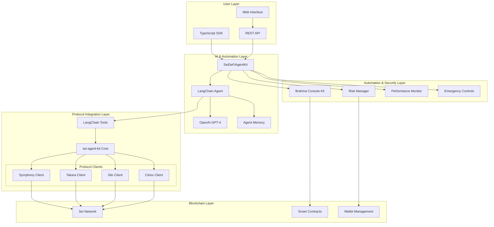
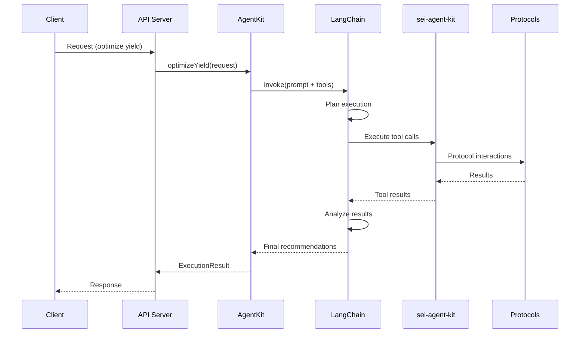

# Architecture Documentation

This document provides an in-depth technical overview of the Sei DeFi Agent architecture, design patterns, and integration approaches.

## System Architecture Overview

The Sei DeFi Agent is built as a modular, AI-driven automation platform that leverages the sei-agent-kit for unified protocol interactions and LangChain for intelligent decision-making.

### High-Level Architecture



## Core Components Deep Dive

### 1. SeiDeFiAgentKit (Main Orchestrator)

The central component that coordinates all system operations.

#### Key Responsibilities:
- Initialize and manage sei-agent-kit integration
- Coordinate LangChain agent operations  
- Handle risk management and monitoring
- Provide unified API for external interactions
- Manage configuration and state

#### Architecture Pattern:
```typescript
class SeiDeFiAgentKit {
  private seiKit: SeiAgentKit;          // Protocol interactions
  private agent: ReactAgent;            // AI decision engine
  private tools: SeiTool[];            // Available actions
  private memory: MemorySaver;         // Conversation memory
  
  // Core methods
  async optimizeYield(request): Promise<ExecutionResult>
  async assessRisk(address): Promise<RiskAssessment>
  async executeStrategy(strategy, params): Promise<ExecutionResult>
}
```

### 2. sei-agent-kit Integration

The sei-agent-kit provides the foundational layer for all Sei protocol interactions.

#### Integration Pattern:
```typescript
// sei-agent-kit initialization
const seiKit = new SeiAgentKit(
  privateKey,
  ModelProviderName.OPENAI
);

// Protocol operations through unified interface
await seiKit.swap(amount, tokenIn, tokenOut);      // Symphony
await seiKit.mintTakara(ticker, amount);           // Takara
await seiKit.stake(amount);                        // Silo
await seiKit.citrexPlaceOrder(orderArgs);         // Citrex
```

#### Available Protocols:
- **Symphony**: DEX aggregator for optimal swapping
- **Takara**: Lending and borrowing protocol
- **Silo**: Liquid staking for SEI tokens
- **Citrex**: Perpetual futures trading
- **Carbon**: MEV-protected trading strategies

### 3. LangChain AI Agent System

The AI layer that provides intelligent decision-making capabilities.

#### Agent Architecture:
```typescript
const agent = createReactAgent({
  llm: new ChatOpenAI({
    model: "gpt-4o",
    temperature: 0
  }),
  tools: createSeiTools(seiKit),
  checkpointSaver: new MemorySaver()
});
```

#### Tool System:
Each protocol operation is wrapped as a LangChain tool:
```typescript
export class SeiSwapTool extends Tool {
  name = "seiSwap";
  description = "Swap tokens using Symphony DEX";
  
  async _call(input: string): Promise<string> {
    const { amount, tokenIn, tokenOut } = JSON.parse(input);
    return await this.seiKit.swap(amount, tokenIn, tokenOut);
  }
}
```

### 4. Automation Workflow Engine

Handles automated execution through Brahma Console Kit integration.

#### Workflow Pattern:
```typescript
class SeiDeFiAgent {
  async executeHandler(taskParams: TaskParams): Promise<ExecutionResult> {
    // 1. Validate parameters
    if (!this.validateTaskParams(taskParams)) return skip;
    
    // 2. Build optimization request
    const request = this.buildOptimizationRequest(taskParams);
    
    // 3. Execute AI-powered optimization
    const result = await this.agentKit.optimizeYield(request);
    
    // 4. Update metrics and return
    await this.updatePerformanceMetrics(result);
    return result;
  }
}
```

## Data Flow Architecture

### 1. Request Processing Flow



### 2. Data Storage & State Management

#### Memory Architecture:
```typescript
interface AgentMemory {
  conversationHistory: Message[];
  userPreferences: UserPrefs;
  performanceMetrics: Metrics;
  riskProfiles: RiskProfile[];
  tradeHistory: TradeRecord[];
}
```

#### State Persistence:
- **Configuration**: Environment variables and JSON files
- **Performance Data**: In-memory with optional persistence
- **Trade History**: Circular buffer with configurable retention
- **Risk Profiles**: Cached with periodic updates
- **Agent Memory**: LangGraph checkpoint system

## Integration Patterns

### 1. Protocol Integration Pattern

Each protocol follows a standardized integration pattern:

```typescript
// 1. Core client implementation
export class ProtocolClient {
  constructor(rpcUrl: string, chainId: number) {}
  
  // Core operations
  async deposit(params): Promise<TransactionResult>
  async withdraw(params): Promise<TransactionResult>
  async getPosition(user): Promise<Position>
  async getAPY(): Promise<string>
}

// 2. sei-agent-kit integration
export class SeiAgentKit {
  async protocolDeposit(params): Promise<string> {
    return this.protocolClient.deposit(params);
  }
}

// 3. LangChain tool wrapper
export class ProtocolDepositTool extends Tool {
  async _call(input: string): Promise<string> {
    return await this.seiKit.protocolDeposit(params);
  }
}
```

### 2. AI Prompt Engineering Pattern

Structured prompts ensure consistent AI behavior:

```typescript
const promptTemplate = `
System Context:
- Available protocols: ${protocolList}
- User preferences: ${userPrefs}
- Risk parameters: ${riskLimits}
- Current positions: ${positions}

Task:
${userRequest}

Constraints:
- Maximum slippage: ${maxSlippage}
- Risk tolerance: ${riskTolerance}
- Gas optimization: Always consider gas costs

Output Format:
Provide step-by-step execution plan with tool calls.
`;
```

### 3. Risk Management Pattern

Multi-layered risk management:

```typescript
class RiskManager {
  // Layer 1: Parameter validation
  validateRequest(request): boolean
  
  // Layer 2: Position limits
  checkPositionLimits(amount, protocol): boolean
  
  // Layer 3: Health factor monitoring
  monitorHealthFactor(userAddress): Promise<number>
  
  // Layer 4: Emergency controls
  executeEmergencyStop(): Promise<void>
}
```

## Scalability Architecture

### 1. Horizontal Scaling

#### Multi-Agent Deployment:
```typescript
// Agent factory pattern
class AgentFactory {
  createAgent(config: AgentConfig): SeiDeFiAgent {
    return new SeiDeFiAgent(config);
  }
  
  createAgentPool(size: number): AgentPool {
    return new AgentPool(size, this.createAgent);
  }
}
```

#### Load Balancing:
- Round-robin request distribution
- Agent-specific workload management
- Protocol-specific routing

### 2. Performance Optimization

#### Caching Strategy:
```typescript
interface CacheManager {
  // Protocol data caching
  getProtocolAPY(protocol: string): Promise<string>;
  
  // Position caching
  getUserPositions(address: Address): Promise<Position[]>;
  
  // Market data caching
  getTokenPrices(tokens: Address[]): Promise<PriceMap>;
}
```

#### Batch Processing:
- Transaction batching for gas optimization
- Bulk position queries
- Aggregated risk assessments

### 3. Monitoring & Observability

#### Metrics Collection:
```typescript
interface MetricsCollector {
  recordTransaction(tx: Transaction): void;
  recordPerformance(metric: PerformanceMetric): void;
  recordError(error: AgentError): void;
  generateReport(): Promise<Report>;
}
```

#### Health Checks:
- System component health monitoring
- Protocol availability checks
- AI service responsiveness
- Blockchain connectivity status

## Security Architecture

### 1. Key Management

#### Hierarchical Key Structure:
```
Master Key (HSM/Secure Enclave)
├── Agent Operation Keys
├── Emergency Keys  
└── Monitoring Keys
```

#### Key Rotation:
- Automated key rotation schedules
- Emergency key replacement procedures
- Multi-signature requirements for critical operations

### 2. Transaction Security

#### Multi-Signature Patterns:
```typescript
interface MultiSigConfig {
  threshold: number;
  signers: Address[];
  timelock?: number;
  emergencyOverride?: boolean;
}
```

#### Transaction Validation:
- Pre-execution simulation
- Slippage and MEV protection
- Gas limit enforcement
- Destination address verification

### 3. Access Control

#### Role-Based Access Control (RBAC):
```typescript
enum Role {
  ADMIN = "admin",
  OPERATOR = "operator", 
  VIEWER = "viewer",
  EMERGENCY = "emergency"
}

interface Permission {
  resource: string;
  actions: string[];
  conditions?: Condition[];
}
```

## Deployment Architecture

### 1. Environment Separation

#### Development Pipeline:
```
Local Development → Testnet → Staging → Production
     ↓                ↓         ↓          ↓
  Unit Tests      Integration  Load Tests  Monitoring
                    Tests                    Alerts
```

#### Configuration Management:
- Environment-specific configurations
- Secret management with rotation
- Feature flag controls
- Runtime configuration updates

### 2. Infrastructure Components

#### Core Infrastructure:
```yaml
# Kubernetes deployment example
apiVersion: apps/v1
kind: Deployment
metadata:
  name: sei-defi-agent
spec:
  replicas: 3
  template:
    spec:
      containers:
      - name: agent
        image: sei-defi-agent:latest
        env:
        - name: PRIVATE_KEY
          valueFrom:
            secretKeyRef:
              name: agent-secrets
              key: private-key
```

#### Monitoring Stack:
- **Metrics**: Prometheus + Grafana
- **Logs**: ELK Stack (Elasticsearch, Logstash, Kibana)
- **Tracing**: Jaeger for distributed tracing
- **Alerts**: PagerDuty integration

### 3. Disaster Recovery

#### Backup Strategy:
- Automated configuration backups
- Trade history preservation
- Performance data archival
- Emergency runbook procedures

#### Failover Procedures:
- Automatic failover to backup systems
- Manual intervention protocols
- Data consistency checks
- Recovery validation procedures

## Integration Guidelines

### 1. Adding New Protocols

#### Step-by-Step Integration:
1. **Research Protocol**: Understand APIs and smart contracts
2. **Create Client**: Implement protocol-specific client
3. **Add to sei-agent-kit**: Integrate client methods
4. **Create LangChain Tools**: Wrap operations as tools
5. **Update AI Prompts**: Include protocol in optimization logic
6. **Test Integration**: Comprehensive testing on testnet
7. **Deploy to Production**: Gradual rollout with monitoring

#### Integration Checklist:
- [ ] Protocol client implementation
- [ ] Error handling and retry logic
- [ ] Gas optimization
- [ ] Risk parameter integration
- [ ] Performance metrics
- [ ] Documentation updates
- [ ] Test coverage
- [ ] Security review

### 2. Extending AI Capabilities

#### Custom Strategy Development:
```typescript
// 1. Define strategy interface
interface CustomStrategy {
  name: string;
  description: string;
  parameters: StrategyParams;
  execute(params: any): Promise<ExecutionResult>;
}

// 2. Implement strategy
class DeltaNeutralStrategy implements CustomStrategy {
  async execute(params): Promise<ExecutionResult> {
    // Strategy implementation
  }
}

// 3. Register with agent
agentKit.registerStrategy(new DeltaNeutralStrategy());
```

### 3. API Extensions

#### Custom Endpoint Pattern:
```typescript
// 1. Define endpoint handler
app.post('/custom-operation', async (req, res) => {
  try {
    const result = await agentKit.customOperation(req.body);
    res.json(result);
  } catch (error) {
    res.status(500).json({ error: error.message });
  }
});

// 2. Add to agent kit
class SeiDeFiAgentKit {
  async customOperation(params): Promise<Result> {
    // Implementation
  }
}
```

## Future Architecture Considerations

### 1. Multi-Chain Expansion

#### Cross-Chain Architecture:
```typescript
interface ChainManager {
  chains: Map<number, ChainConfig>;
  
  async executeOnChain(chainId: number, operation: Operation): Promise<Result>;
  async bridgeAssets(from: number, to: number, asset: Asset): Promise<string>;
}
```

### 2. Advanced AI Integration

#### Machine Learning Pipeline:
- Strategy performance modeling
- Risk prediction algorithms
- Market sentiment analysis
- Automated strategy generation

### 3. Decentralized Architecture

#### Decentralization Roadmap:
- Distributed agent networks
- Consensus-based decision making
- Decentralized governance
- Community-driven strategy development

---

This architecture documentation provides the technical foundation for understanding, extending, and operating the Sei DeFi Agent system. The modular design ensures scalability, security, and maintainability while enabling rapid integration of new protocols and features. 