# System Architecture Overview

## Introduction

The Sei DeFi Agent is a comprehensive AI-powered automation system that leverages multiple technologies to provide intelligent DeFi operations on the Sei blockchain. This document provides a high-level overview of the system architecture and how all components interact.

## Core Components

### 1. **Frontend Layer**
- **Next.js Application** (Port 3001)
- **Chat Interface** - Natural language interaction with the AI agent
- **Automation Dashboard** - Configure and monitor automation scenarios
- **WebSocket Connection** - Real-time updates and monitoring

### 2. **Backend API Layer**
- **Express Server** (Port 3000)
- **Chat API** - Processes user requests and streams AI responses
- **Automation APIs** - Manage automation scenarios and contexts
- **WebSocket Server** - Real-time monitoring and alerts

### 3. **AI Agent Layer**
- **Sei DeFi Agent Kit** - Core orchestrator for all AI operations
- **LangChain Integration** - Tool execution and reasoning
- **OpenAI GPT-4** - Natural language processing and decision making
- **Protocol Tools** - Symphony, Takara, Silo, Citrex integrations

### 4. **Blockchain Layer**
- **Sei Agent Kit** - Direct protocol interactions
- **Sei Blockchain** - Transaction execution and state management
- **DeFi Protocols** - Symphony (DEX), Takara (Lending), Silo (Staking), Citrex (Perps)

### 5. **Automation Layer**
- **Brahma Console Kit** - Enterprise automation and security
- **Dynamic Automation Engine** - Scenario management and execution
- **Brahma Executor** - Secure transaction execution
- **Kernel Workflow** - Hosted task management

## High-Level System Architecture

```mermaid
graph TB
    %% User Layer
    User[👤 User] --> Frontend[🖥️ Frontend<br/>Next.js App<br/>Port 3001]
    
    %% Frontend Layer
    Frontend --> ChatAPI[💬 Chat API<br/>POST /chat]
    Frontend --> AutoAPI[⚙️ Automation API<br/>/automation/*]
    Frontend --> WSMonitor[📊 WebSocket<br/>Real-time Monitoring]
    
    %% Backend Layer
    subgraph Backend["🚀 Backend Server (Port 3000)"]
        ChatAPI --> AgentKit[🤖 Sei DeFi Agent Kit]
        AutoAPI --> AutoEngine[⚡ Dynamic Automation Engine]
        WSMonitor --> Monitor[📈 Real-time Monitor]
    end
    
    %% AI Layer
    subgraph AILayer["🧠 AI Processing Layer"]
        AgentKit --> LangChain[🔗 LangChain Tools]
        AgentKit --> OpenAI[🤖 OpenAI GPT-4]
        LangChain --> SeiKit[⛓️ Sei Agent Kit]
    end
    
    %% Protocol Layer
    subgraph Protocols["🏦 DeFi Protocols"]
        SeiKit --> Symphony[🎵 Symphony DEX]
        SeiKit --> Takara[🏛️ Takara Lending]
        SeiKit --> Silo[🌾 Silo Staking]
        SeiKit --> Citrex[📈 Citrex Perps]
    end
    
    %% Automation Layer
    subgraph Brahma["🛡️ Brahma Console Kit"]
        AutoEngine --> Executor[👨‍💼 Brahma Executor]
        Executor --> Kernel[⚙️ Kernel Workflow]
        Kernel --> Tasks[📋 Task Queue]
        Tasks --> ConsoleKit[🎛️ Console Kit]
    end
    
    %% Blockchain Layer
    subgraph Blockchain["⛓️ Sei Blockchain"]
        Symphony --> SeiChain[Sei Network]
        Takara --> SeiChain
        Silo --> SeiChain
        Citrex --> SeiChain
        ConsoleKit --> SeiChain
    end
    
    %% Data Flow
    Monitor --> AgentKit
    AutoEngine --> AgentKit
    
    %% Styling
    classDef frontend fill:#e1f5fe
    classDef backend fill:#f3e5f5
    classDef ai fill:#e8f5e8
    classDef protocol fill:#fff3e0
    classDef automation fill:#fce4ec
    classDef blockchain fill:#f1f8e9
    
    class Frontend frontend
    class Backend backend
    class AILayer ai
    class Protocols protocol
    class Brahma automation
    class Blockchain blockchain
```

## Component Responsibilities

### Frontend (Next.js)
- **User Interface**: Chat interface for natural language interaction
- **Automation Dashboard**: Configure scenarios, view metrics, manage settings
- **Real-time Updates**: WebSocket connection for live monitoring
- **API Proxy**: Routes requests to backend, handles authentication

### Backend (Express)
- **API Gateway**: Handles all frontend requests
- **Agent Orchestration**: Manages Sei DeFi Agent Kit instances
- **Automation Management**: Controls Dynamic Automation Engine
- **Monitoring**: Real-time metrics and alerting system

### Sei DeFi Agent Kit
- **Core AI Engine**: Processes natural language requests
- **Tool Execution**: Executes protocol-specific operations
- **Strategy Management**: Implements yield optimization and risk management
- **Integration Hub**: Coordinates between AI, protocols, and automation

### Brahma Console Kit
- **Executor Framework**: Secure automation execution environment
- **Policy Enforcement**: Ensures operations stay within defined limits
- **Kernel Workflow**: Hosted task management and scheduling
- **Security Layer**: Multi-signature and permission management

### Dynamic Automation Engine
- **Scenario Management**: Handles complex automation scenarios
- **Trigger System**: Time-based, price-based, and condition-based triggers
- **Risk Assessment**: Continuous monitoring and risk evaluation
- **Performance Tracking**: Metrics collection and analysis

## Data Flow Summary

1. **User Input** → Frontend captures natural language requests
2. **API Processing** → Backend processes and validates requests  
3. **AI Reasoning** → Agent Kit uses GPT-4 to understand and plan
4. **Tool Execution** → LangChain tools interact with DeFi protocols
5. **Automation Setup** → Dynamic engine creates automation scenarios
6. **Brahma Integration** → Executor registers and receives tasks
7. **Transaction Execution** → Kernel workflow manages secure execution
8. **Monitoring** → Real-time feedback to user through WebSocket

## Security Architecture

### Multi-Layer Security
1. **Frontend**: Input validation, rate limiting, HTTPS
2. **Backend**: API authentication, request validation, sanitization
3. **Agent Kit**: Controlled tool execution, parameter validation
4. **Brahma**: Policy enforcement, multi-signature, time locks
5. **Blockchain**: Cryptographic security, immutable execution

### Private Key Management
- **User Keys**: Remain on user devices, never transmitted
- **Executor Keys**: Securely managed by Brahma infrastructure
- **Agent Keys**: Isolated environment variables, hardware security modules

### Permission Model
- **User Delegation**: Users explicitly delegate specific permissions
- **Policy Constraints**: Brahma enforces transaction limits and allowed protocols
- **Emergency Controls**: Immediate stop mechanisms and admin overrides

## Scalability Design

### Horizontal Scaling
- **Stateless Services**: Backend and agent components are stateless
- **Load Balancing**: Multiple instances behind load balancers
- **Database Clustering**: Distributed data storage and caching

### Performance Optimization
- **Caching**: Redis for frequently accessed data
- **Async Processing**: Non-blocking operation execution
- **Connection Pooling**: Efficient blockchain connection management

### Monitoring & Observability
- **Metrics Collection**: Comprehensive performance and business metrics
- **Log Aggregation**: Centralized logging with structured data
- **Alerting**: Real-time alerts for system and business events
- **Dashboards**: Visual monitoring and analytics

## Technology Stack

### Frontend
- **Framework**: Next.js 14 with TypeScript
- **UI**: Tailwind CSS, shadcn/ui components
- **State**: React hooks, WebSocket integration
- **Build**: Turbo, ESLint, Prettier

### Backend
- **Runtime**: Node.js with TypeScript
- **Framework**: Express.js
- **AI**: OpenAI GPT-4, LangChain
- **Blockchain**: ethers.js, viem

### Automation
- **Console Kit**: Brahma Console Kit v1.0.19
- **Execution**: Custom automation engine
- **Monitoring**: Real-time WebSocket updates
- **Storage**: In-memory with Redis caching

### Infrastructure
- **Deployment**: Docker containers
- **Orchestration**: Kubernetes clusters
- **Monitoring**: Prometheus, Grafana
- **Logging**: ELK stack (Elasticsearch, Logstash, Kibana)

This architecture ensures scalable, secure, and intelligent DeFi automation while maintaining user control and transparency throughout the entire process. 