# User Request Flow: From Input to Execution

## Overview

This document details the complete flow of a user request from initial input (e.g., "optimize my yield") through AI processing, transaction building, and automated execution via Brahma Console Kit.

## Example Scenario

**User Request**: *"I want to optimize my yield. I have 1000 USDC and want to earn the best APY with medium risk tolerance."*

## Complete Request Flow

```mermaid
sequenceDiagram
    participant User as 👤 User
    participant Frontend as 🖥️ Frontend
    participant Backend as 🚀 Backend API
    participant AgentKit as 🤖 Sei DeFi Agent Kit
    participant LangChain as 🔗 LangChain
    participant OpenAI as 🤖 OpenAI GPT-4
    participant SeiKit as ⛓️ Sei Agent Kit
    participant AutoEngine as ⚡ Automation Engine
    participant Brahma as 🛡️ Brahma Console Kit
    participant Blockchain as ⛓️ Sei Blockchain

    %% User Input Phase
    User->>Frontend: "Optimize my yield with 1000 USDC, medium risk"
    Frontend->>Backend: POST /chat { message, userAddress }
    
    %% AI Processing Phase
    Backend->>AgentKit: processUserRequest(message, context)
    AgentKit->>OpenAI: Analyze request and plan strategy
    OpenAI-->>AgentKit: Strategy: "Analyze markets, find best APY, execute"
    
    %% Market Analysis
    AgentKit->>LangChain: Execute analysis tools
    LangChain->>SeiKit: getYieldOpportunities()
    SeiKit->>Blockchain: Query Symphony, Takara, Silo APYs
    Blockchain-->>SeiKit: Current APY data
    SeiKit-->>LangChain: Yield opportunities array
    
    %% Risk Assessment
    LangChain->>SeiKit: assessRisk(userAddress, opportunities)
    SeiKit->>Blockchain: Check user positions, protocol risks
    Blockchain-->>SeiKit: Risk assessment data
    SeiKit-->>LangChain: Risk scores and recommendations
    
    %% Strategy Generation
    LangChain-->>AgentKit: Analysis complete + recommendations
    AgentKit->>OpenAI: Generate optimal strategy
    OpenAI-->>AgentKit: "Deposit 600 USDC in Takara (8.5% APY), 400 in Silo (6.2% APY)"
    
    %% Transaction Building
    AgentKit->>LangChain: buildTransactions(strategy)
    LangChain->>SeiKit: buildDepositTransaction(takara, 600)
    SeiKit-->>LangChain: Transaction data 1
    LangChain->>SeiKit: buildStakeTransaction(silo, 400)
    SeiKit-->>LangChain: Transaction data 2
    LangChain-->>AgentKit: [transaction1, transaction2]
    
    %% Automation Setup
    AgentKit->>AutoEngine: createAutomationScenario(userAddress, strategy)
    AutoEngine->>AutoEngine: Create yield optimization scenario
    AutoEngine->>AutoEngine: Set up monitoring triggers
    
    %% Brahma Integration
    AutoEngine->>Brahma: registerAutomationTask(userAddress, transactions)
    Brahma->>Brahma: Validate against policies
    Brahma->>Brahma: Create task in queue
    
    %% Response to User
    AgentKit-->>Backend: ExecutionResult + automation setup
    Backend-->>Frontend: Stream response with plan
    Frontend-->>User: "I found optimal yield strategy. Executing..."
    
    %% Execution Phase (Automated by Brahma)
    Note over Brahma,Blockchain: Brahma Kernel executes tasks automatically
    Brahma->>Blockchain: Execute transaction 1 (Takara deposit)
    Blockchain-->>Brahma: Transaction success + hash
    Brahma->>Blockchain: Execute transaction 2 (Silo stake)
    Blockchain-->>Brahma: Transaction success + hash
    
    %% Completion Notification
    Brahma-->>AutoEngine: Task completed successfully
    AutoEngine-->>Backend: Execution complete notification
    Backend-->>Frontend: WebSocket update
    Frontend-->>User: "✅ Yield optimization complete! APY: 7.8%"
```



## Detailed Flow Breakdown

### Phase 1: User Input Processing

#### 1.1 Frontend Capture
```typescript
// Frontend: app/page.tsx
const handleSubmit = async (message: string) => {
  const response = await fetch('/api/chat', {
    method: 'POST',
    headers: { 'Content-Type': 'application/json' },
    body: JSON.stringify({ 
      message: "Optimize my yield with 1000 USDC, medium risk",
      userAddress: "0x..." 
    })
  });
};
```

#### 1.2 Backend API Processing
```typescript
// Backend: src/index.ts - POST /chat
app.post('/chat', async (req, res) => {
  const { message, userAddress } = req.body;
  
  // Stream response to frontend
  res.writeHead(200, {
    'Content-Type': 'text/plain',
    'Transfer-Encoding': 'chunked'
  });
  
  // Process with Agent Kit
  const result = await agentKit.optimizeYield({
    userAddress,
    baseToken: "USDC",
    targetAPY: "8.0",
    riskTolerance: "medium"
  });
});
```

### Phase 2: AI Analysis & Strategy Generation

#### 2.1 Agent Kit Processing
```typescript
// src/agent-kit/index.ts
async optimizeYield(request: YieldOptimizationRequest): Promise<ExecutionResult> {
  const prompt = this.buildOptimizationPrompt(request);
  
  // AI generates strategy using available tools
  const result = await this.agent.invoke({
    messages: [{ role: "user", content: prompt }]
  });
  
  return result;
}
```

#### 2.2 LangChain Tool Execution
```typescript
// Available tools for AI:
const tools = [
  new SeiGetYieldOpportunitiesTool(seiKit),    // Get APY data
  new SeiAssessRiskTool(seiKit),               // Risk analysis
  new SeiMintTakaraTool(seiKit),               // Lending deposits
  new SeiStakeTool(seiKit),                    // Staking operations
  new SeiSwapTool(seiKit)                      // Token swaps
];
```

### Phase 3: Market Analysis

#### 3.1 Protocol Data Fetching
```typescript
// Sei Agent Kit queries multiple protocols
const opportunities = await Promise.all([
  takaraClient.getAPY("USDC"),      // 8.5% APY
  siloClient.getStakingAPY(),       // 6.2% APY  
  symphonyClient.getLPRewards(),    // 12.3% APY (high risk)
  citrexClient.getFundingRates()    // Variable rates
]);
```

#### 3.2 Risk Assessment
```typescript
// Risk scoring algorithm
const riskScore = calculateRisk({
  protocolTVL: protocolData.tvl,
  historicalPerformance: protocolData.history,
  smartContractAudits: protocolData.audits,
  liquidityDepth: protocolData.liquidity,
  userRiskTolerance: "medium"
});
```

### Phase 4: Strategy Generation

#### 4.1 AI Decision Making
```
GPT-4 Analysis:
- User has 1000 USDC, medium risk tolerance
- Takara lending: 8.5% APY, low risk (TVL: $50M, audited)
- Silo staking: 6.2% APY, very low risk (native staking)
- Symphony LP: 12.3% APY, high risk (impermanent loss)

Optimal Strategy:
- 60% to Takara (600 USDC) - Stable yield
- 40% to Silo (400 USDC) - Conservative backing
- Expected blended APY: 7.68%
```

#### 4.2 Transaction Building
```typescript
const transactions = [
  {
    to: TAKARA_COMPTROLLER,
    data: encodeFunction("mint", [usdcAddress, parseEther("600")]),
    value: "0"
  },
  {
    to: SILO_HUB,  
    data: encodeFunction("stake", [parseEther("400")]),
    value: parseEther("400") // Native SEI staking
  }
];
```

### Phase 5: Automation Setup

#### 5.1 Dynamic Automation Engine
```typescript
// Create automation scenario
const scenario: AutomationScenario = {
  id: `yield_opt_${Date.now()}`,
  type: 'yield_optimization',
  enabled: true,
  triggers: [
    {
      type: 'time_based',
      condition: 'every_24_hours',
      value: 24
    },
    {
      type: 'apy_based', 
      condition: 'better_apy_available',
      value: 1.0 // 1% better APY threshold
    }
  ],
  parameters: {
    targetAPY: "8.0",
    maxSlippage: "0.5",
    riskTolerance: "medium"
  }
};
```

### Phase 6: Brahma Console Kit Integration

#### 6.1 Task Creation
```typescript
// Brahma task format
const taskParams: TaskParams = {
  subAccountAddress: userAddress,
  chainID: 1329,
  subscription: {
    id: scenario.id,
    metadata: {
      baseToken: "USDC",
      targetAPY: "8.0",
      riskTolerance: "medium"
    },
    tokenInputs: { "USDC": "1000" },
    tokenLimits: { "USDC": "1000" }
  }
};
```

#### 6.2 Executor Processing
```typescript
// Brahma Executor receives task
async executeHandler(taskParams: TaskParams): Promise<ExecutionResult> {
  // Validate parameters
  if (!this.validateTaskParams(taskParams)) {
    return { skip: true, message: 'Invalid parameters' };
  }
  
  // Execute through automation engine
  const result = await this.dynamicEngine.executeAutomationTasks(taskParams);
  
  return {
    skip: false,
    message: 'Yield optimization executed',
    transactions: result.transactions,
    expectedProfit: result.expectedProfit
  };
}
```

### Phase 7: Secure Execution

#### 7.1 Transaction Signing & Submission
```typescript
// Generate executable digest
const { domain, message, types } = 
  await consoleKit.automationContext.generateExecutableDigest712Message({
    account: taskParams.subAccountAddress,
    chainId: 1329,
    data: transaction.data,
    executor: executorAddress,
    nonce: executorNonce,
    operation: 0,
    pluginAddress: consoleKit.getContractAddress("EXECUTOR_PLUGIN"),
    to: transaction.to,
    value: transaction.value
  });

// Sign with executor private key
const signature = await executorWallet.signTypedData(domain, types, message);

// Submit to Brahma
await consoleKit.automationContext.submitTask({
  id: taskId,
  payload: {
    task: {
      executable: {
        callType: 0,
        data: transaction.data,
        to: transaction.to,
        value: transaction.value
      },
      executorSignature: signature,
      executor: executorAddress,
      skip: false,
      subaccount: taskParams.subAccountAddress
    }
  },
  registryId
});
```

### Phase 8: Monitoring & Feedback

#### 8.1 Real-time Updates
```typescript
// WebSocket updates to frontend
wsServer.broadcastTradeExecution({
  id: transactionHash,
  timestamp: Date.now(),
  type: 'deposit',
  protocol: 'takara',
  amount: '600',
  token: 'USDC',
  profit: '51.3', // Expected annual profit
  gasUsed: '150000',
  transactionHash,
  status: 'success'
}, userAddress);
```

## Key Benefits of This Architecture

### 1. **Intelligent Processing**
- Natural language understanding via GPT-4
- Real-time market analysis across multiple protocols
- Risk-adjusted strategy generation

### 2. **Secure Automation**
- Brahma Console Kit policy enforcement
- Multi-signature security
- Controlled execution environment

### 3. **Transparent Execution**
- Real-time monitoring and feedback
- Complete transaction history
- Performance analytics

### 4. **Scalable Design**
- Stateless components
- Async processing
- Efficient resource utilization

This flow ensures that user requests are processed intelligently, executed securely, and monitored transparently while maintaining complete user control and security throughout the entire process. 