# Brahma Executor Flow: Registration to Execution

## Overview

This document details the complete Brahma Console Kit integration flow, including executor registration, kernel workflow management, and secure task execution. It explains who the executor is, how it operates, and how tasks flow through the Brahma ecosystem.

## Who is the Executor?

### Executor Definition
The **Executor** is a specialized smart contract wallet managed by the Sei DeFi Agent that:
- **Operates on behalf of users** with delegated permissions
- **Executes DeFi transactions** within strict policy constraints  
- **Maintains security** through Brahma's policy enforcement
- **Provides automation** via hosted workflow infrastructure

### Executor Characteristics
- **Address**: Deterministic address derived from executor private key
- **Permissions**: Limited by user-defined policies (tokens, protocols, amounts)
- **Security**: Protected by Brahma's multi-signature and time-lock mechanisms
- **Scope**: Can only execute pre-approved operations within policy limits

## Complete Brahma Integration Flow

```mermaid
graph TB
    %% Registration Phase
    subgraph Registration["🔐 Executor Registration (One-time)"]
        DevTeam[👨‍💻 Development Team] --> ConsoleReg[📝 Console Registration]
        ConsoleReg --> PolicySetup[⚖️ Policy Setup<br/>- Hop Addresses<br/>- Input Tokens<br/>- Execution Limits]
        PolicySetup --> KernelReg[⚙️ Kernel Registration<br/>- Execution TTL<br/>- Default Interval<br/>- Task Type]
        KernelReg --> RegistryID[🆔 Registry ID Generated]
    end
    
    %% User Subscription Phase
    subgraph UserSub["👤 User Subscription"]
        User[User] --> CreateAccount[🏦 Create Brahma Account]
        CreateAccount --> SetupSub[📋 Setup Subaccount<br/>& Permissions]
        SetupSub --> DelegatePerms[🔑 Delegate Permissions<br/>to Executor]
        DelegatePerms --> UserPolicy[📜 User Policy Creation<br/>- Token Limits<br/>- Duration<br/>- Allowed Operations]
    end
    
    %% Task Creation Phase  
    subgraph TaskFlow["📋 Task Creation & Queuing"]
        AgentRequest[🤖 Agent Request] --> CreateTask[📝 Create Automation Task]
        CreateTask --> ValidatePolicy[✅ Validate Against Policy]
        ValidatePolicy --> QueueTask[📥 Queue in Kernel]
        QueueTask --> TaskScheduled[⏰ Task Scheduled]
    end
    
    %% Execution Phase
    subgraph Execution["⚡ Task Execution"]
        TaskScheduled --> KernelPoll[🔄 Kernel Polling Cycle]
        KernelPoll --> FetchTasks[📥 Fetch Pending Tasks]
        FetchTasks --> ExecutorProcess[👨‍💼 Executor Processing]
        ExecutorProcess --> BuildTx[🔨 Build Transactions]
        BuildTx --> SignTx[✍️ Sign with Executor Key]
        SignTx --> SubmitTx[📤 Submit to Blockchain]
        SubmitTx --> MonitorTx[👀 Monitor Execution]
        MonitorTx --> UpdateStatus[📊 Update Task Status]
    end
    
    %% Monitoring Phase
    subgraph Monitoring["📊 Monitoring & Feedback"]
        UpdateStatus --> LogExecution[📝 Log Execution Results]
        LogExecution --> NotifyUser[📱 Notify User]
        NotifyUser --> UpdateMetrics[📈 Update Performance Metrics]
        UpdateMetrics --> NextCycle[🔄 Next Polling Cycle]
    end
    
    %% Connections
    RegistryID --> UserSub
    UserPolicy --> TaskFlow
    NextCycle --> KernelPoll
    
    %% Styling
    classDef registration fill:#ffe0e0
    classDef user fill:#e0e0ff
    classDef task fill:#e0ffe0
    classDef execution fill:#fff0e0
    classDef monitoring fill:#f0e0ff
    
    class Registration registration
    class UserSub user
    class TaskFlow task
    class Execution execution
    class Monitoring monitoring
```



## Detailed Registration Process

### Phase 1: Console Registration

```mermaid
sequenceDiagram
    participant Dev as 👨‍💻 Dev Team
    participant Registration as 🔐 Registration Service
    participant Console as 🎛️ Brahma Console
    participant Executor as 👨‍💼 Executor Wallet

    %% Console Registration
    Dev->>Registration: initiate registration process
    Registration->>Registration: configure executor policies
    Note over Registration: hopAddresses: [Symphony, Takara, Silo, Citrex]<br/>inputTokens: [SEI, USDC, USDT]<br/>limitPerExecution: true
    
    Registration->>Console: generateConsoleRegistration712Message()
    Console-->>Registration: { domain, message, types }
    Registration->>Executor: signTypedData(domain, types, message)
    Executor-->>Registration: executorRegistrationSignature
    
    Registration->>Console: registerExecutorOnConsole(signature, config)
    Console->>Console: validate signature & configuration
    Console->>Console: create executor entry
    Console-->>Registration: { id: registryId, status: "registered" }
    
    Note over Registration,Console: Executor now registered with policy constraints
```



### Phase 2: Kernel Registration

```mermaid
sequenceDiagram
    participant Registration as 🔐 Registration Service
    participant Kernel as ⚙️ Brahma Kernel
    participant Executor as 👨‍💼 Executor Wallet

    %% Kernel Registration
    Registration->>Kernel: generateKernelRegistration712Message()
    Note over Registration: Config: defaultEvery: "300s"<br/>executionTTL: "180s"<br/>type: "INTERVAL"
    
    Kernel-->>Registration: { domain, message, types }
    Registration->>Executor: signTypedData(domain, types, message)
    Executor-->>Registration: kernelRegistrationSignature
    
    Registration->>Kernel: registerExecutorOnKernel(registryId, signature)
    Kernel->>Kernel: validate registration
    Kernel->>Kernel: setup hosted workflow
    Kernel-->>Registration: executorDetails
    
    Note over Registration,Kernel: Executor ready for hosted workflows
```



## Task Execution Workflow

### Kernel Polling & Task Processing

```mermaid
sequenceDiagram
    participant Executor as 👨‍💼 Executor Process
    participant Kernel as ⚙️ Brahma Kernel
    participant Engine as ⚡ Automation Engine
    participant SeiKit as ⛓️ Sei Agent Kit
    participant Blockchain as 🔗 Sei Blockchain

    %% Polling Cycle
    loop Every 30 seconds
        Executor->>Kernel: fetchTasks(registryId, offset, limit)
        Kernel-->>Executor: taskArray[]
        
        alt Tasks Found
            loop For each task
                Executor->>Executor: validateTaskParams(task)
                
                alt Valid Task
                    Executor->>Engine: executeAutomationTasks(taskParams)
                    Engine->>Engine: processScenarios(userAddress)
                    Engine->>SeiKit: executeProtocolOperations()
                    SeiKit->>Blockchain: queryAPYs, buildTransactions
                    Blockchain-->>SeiKit: protocolData, txData
                    SeiKit-->>Engine: transactionResults
                    Engine-->>Executor: { transactions, gasEstimate, expectedProfit }
                    
                    Executor->>Kernel: fetchExecutorNonce(subAccount, executor, chainId)
                    Kernel-->>Executor: executorNonce
                    
                    Executor->>Executor: prepareTransaction(transactions)
                    Note over Executor: Handle multi-tx with encodeMulti
                    
                    Executor->>Kernel: generateExecutableDigest712Message(txData)
                    Kernel-->>Executor: { domain, message, types }
                    Executor->>Executor: signTypedData(domain, types, message)
                    
                    Executor->>Kernel: submitTask(taskId, signedPayload)
                    Kernel->>Blockchain: executeTransaction()
                    Blockchain-->>Kernel: txHash, status
                    
                    Executor->>Kernel: fetchWorkflowState(taskId)
                    Kernel-->>Executor: workflowStatus
                    
                else Invalid Task
                    Executor->>Executor: skipTask(reason)
                end
            end
        else No Tasks
            Executor->>Executor: wait(30s)
        end
    end
```



## Policy Enforcement Architecture

### Console Policy Configuration

```typescript
// Executor Policy Setup
const executorConfig: ConsoleExecutorConfig = {
  clientId: "sei-defi-agent",
  executor: "0x...", // Executor wallet address
  feeReceiver: "0x0000000000000000000000000000000000000000",
  
  // Protocols the executor can interact with
  hopAddresses: [
    "0x...", // Symphony Router
    "0x...", // Takara Comptroller  
    "0x...", // Silo Hub
    "0x...", // Citrex Exchange
    "0xEf59f0AD1bE369189e7dD30Fb474263a87400C73" // Console Fee Receiver (Required)
  ],
  
  // Tokens the executor can use
  inputTokens: [
    "0x0000000000000000000000000000000000000000", // Native SEI
    "0x...", // USDC on Sei
    "0x...", // USDT on Sei
    "0x..."  // Other approved tokens
  ],
  
  limitPerExecution: true, // Limits apply per transaction
  timestamp: new Date().getTime()
};
```

### User-Level Policy Creation

```typescript
// User subscribes with specific limits
const userPolicy = {
  tokenLimits: {
    "USDC": "10000", // Max 10,000 USDC per execution
    "SEI": "50000",  // Max 50,000 SEI per execution
  },
  duration: 86400, // 24 hours
  allowedOperations: [
    "mint", "redeem", "stake", "unstake", "swap"
  ],
  maxSlippage: "0.5", // 0.5% max slippage
  emergencyStopLoss: "10" // 10% emergency stop loss
};
```

## Security Mechanisms

### Multi-Layer Security

```mermaid
graph TB
    %% Input Validation
    subgraph Input["🔍 Input Validation"]
        UserInput[User Input] --> ParamValidation[Parameter Validation]
        ParamValidation --> AddressValidation[Address Validation]
        AddressValidation --> AmountValidation[Amount Validation]
    end
    
    %% Policy Enforcement
    subgraph Policy["⚖️ Policy Enforcement"]
        AmountValidation --> PolicyCheck[Policy Constraint Check]
        PolicyCheck --> HopAddressCheck[Hop Address Validation]
        HopAddressCheck --> TokenLimitCheck[Token Limit Validation]
        TokenLimitCheck --> TimeConstraintCheck[Time Constraint Check]
    end
    
    %% Execution Security
    subgraph ExecSec["🔐 Execution Security"]
        TimeConstraintCheck --> NonceValidation[Nonce Validation]
        NonceValidation --> SignatureGen[EIP-712 Signature Generation]
        SignatureGen --> MultiSigValidation[Multi-Signature Validation]
        MultiSigValidation --> ExecutionEngine[Execution Engine]
    end
    
    %% Transaction Security
    subgraph TxSec["🛡️ Transaction Security"]
        ExecutionEngine --> GasEstimation[Gas Estimation]
        GasEstimation --> SlippageProtection[Slippage Protection]
        SlippageProtection --> MEVProtection[MEV Protection]
        MEVProtection --> BlockchainExecution[Blockchain Execution]
    end
    
    %% Monitoring
    subgraph Monitor["👀 Monitoring"]
        BlockchainExecution --> TxMonitoring[Transaction Monitoring]
        TxMonitoring --> StatusUpdates[Status Updates]
        StatusUpdates --> AlertSystem[Alert System]
        AlertSystem --> EmergencyStop[Emergency Stop Mechanism]
    end
    
    %% Styling
    classDef input fill:#e1f5fe
    classDef policy fill:#f3e5f5
    classDef execsec fill:#e8f5e8
    classDef txsec fill:#fff3e0
    classDef monitor fill:#fce4ec
    
    class Input input
    class Policy policy
    class ExecSec execsec
    class TxSec txsec
    class Monitor monitor
```



## Key Components Breakdown

### 1. **Executor Identity**
- **Type**: EOA (Externally Owned Account) wallet
- **Generated**: From secure private key (EXECUTOR_PRIVATE_KEY)
- **Purpose**: Signs transactions on behalf of users within policy limits
- **Security**: Protected by Brahma's infrastructure, never exposed to users

### 2. **Registry ID**
- **Format**: UUID generated during Console registration
- **Purpose**: Unique identifier for the executor in Brahma's system
- **Usage**: Used for task fetching, status monitoring, and workflow management
- **Lifecycle**: Permanent identifier tied to executor configuration

### 3. **Kernel Workflow**
- **Type**: Hosted infrastructure managed by Brahma
- **Function**: Automatic task scheduling, distribution, and monitoring
- **Benefits**: Removes operational overhead from developers
- **Scale**: Handles thousands of automation tasks efficiently

### 4. **Task Queue**
- **Storage**: Managed by Brahma's Kernel infrastructure
- **Processing**: FIFO (First In, First Out) with priority support
- **Persistence**: Tasks persist until successful execution or expiration
- **Monitoring**: Real-time status tracking and execution logging

## Performance & Scalability

### Execution Metrics
- **Polling Interval**: 30 seconds (configurable)
- **Task Processing**: ~10 tasks per polling cycle
- **Execution TTL**: 180 seconds per task
- **Concurrent Users**: Unlimited (stateless architecture)

### Error Handling
- **Task Validation**: Skip invalid tasks with detailed logging
- **Transaction Failures**: Automatic retry with exponential backoff
- **Network Issues**: Graceful degradation and recovery
- **Emergency Stops**: Immediate halt mechanism for critical failures

### Monitoring & Alerting
- **Real-time Status**: WebSocket updates to frontend
- **Performance Metrics**: Execution success rates, gas costs, profits
- **Health Monitoring**: System health checks and automated alerts
- **Audit Trails**: Complete transaction and execution history

This architecture ensures secure, scalable, and efficient automation while maintaining complete transparency and user control throughout the entire process. 