# Transaction Execution Flow: From Strategy to Blockchain

## Overview

This document details how the Sei DeFi Agent builds, signs, and executes transactions through the Brahma Console Kit ecosystem. It covers the complete flow from AI strategy generation to on-chain execution with security guarantees.

## Transaction Lifecycle


## Detailed Transaction Building Process

### Phase 1: AI Strategy to Transaction Conversion


### Phase 2: Transaction Data Structure

```typescript
// Individual Transaction Structure
interface Transaction {
  to: string;           // Contract address
  data: string;         // Encoded function call
  value: string;        // ETH/SEI value (in wei)
  operation: number;    // 0 = CALL, 1 = DELEGATECALL
  gasLimit?: string;    // Gas limit (optional)
}

// Example: Takara Mint Transaction
const takaraMintTx: Transaction = {
  to: "0x1234...TAKARA_COMPTROLLER",
  data: "0xa0712d68" + // mint(address,uint256) function selector
        "000000000000000000000000833589fCD6eDb6E08f4c7C32D4f71b54bdA02913" + // USDC address
        "0000000000000000000000000000000000000000000000000000002386F26FC10000", // 600 USDC (with decimals)
  value: "0",
  operation: 0 // CALL
};

// Example: Silo Stake Transaction  
const siloStakeTx: Transaction = {
  to: "0x5678...SILO_HUB",
  data: "0xa694fc3a" + // stake(uint256) function selector
        "0000000000000000000000000000000000000000000000000000015AF1D78B58C40000", // 400 SEI (with decimals)
  value: "400000000000000000000", // 400 SEI in wei
  operation: 0 // CALL
};
```

### Phase 3: Multi-Transaction Batching

```mermaid
sequenceDiagram
    participant Executor as 👨‍💼 Executor
    participant MultiSend as 📦 MultiSend Contract
    participant Brahma as 🛡️ Brahma Console Kit

    %% Check transaction count
    Executor->>Executor: Check transaction count
    alt Multiple Transactions
        Executor->>Executor: Import encodeMulti from ethers-multisend
        
        %% Batch encoding
        Executor->>MultiSend: encodeMulti(transactions, MULTI_SEND_ADDRESS)
        Note over MultiSend: Encode multiple calls into single transaction
        MultiSend-->>Executor: Batched transaction data
        
        %% Create batch transaction
        Executor->>Executor: Create batch transaction
        Note over Executor: {<br/>  to: MULTI_SEND_ADDRESS,<br/>  data: encodedBatchData,<br/>  value: "0",<br/>  operation: 1 (DELEGATECALL)<br/>}
        
    else Single Transaction
        Executor->>Executor: Use transaction as-is
        Note over Executor: No batching needed
    end
    
    %% Submit to Brahma
    Executor->>Brahma: Submit final transaction
```



### Phase 4: Brahma Security Processing


### Phase 5: Task Submission Format

```typescript
// Brahma Task Submission Structure
interface TaskSubmission {
  id: string;           // Task ID
  registryId: string;   // Executor registry ID
  payload: {
    task: {
      executable: {
        callType: number;    // 0 = CALL, 1 = DELEGATECALL
        data: string;        // Transaction data
        to: string;          // Contract address
        value: string;       // Transaction value
      };
      executorSignature: string;  // EIP-712 signature
      executor: string;           // Executor address
      skip: boolean;              // Whether to skip execution
      skipReason: string;         // Reason for skipping (if skip = true)
      subaccount: string;         // User subaccount address
    };
  };
}

// Example Task Submission
const taskSubmission: TaskSubmission = {
  id: "task_abc123def456",
  registryId: "registry_789xyz012",
  payload: {
    task: {
      executable: {
        callType: 1, // DELEGATECALL for MultiSend
        data: "0x8d80ff0a000000000000000000000000000000000000000000000000000000000000002000000000000000000000000000000000000000000000000000000000000000f200833589...", // Encoded batch data
        to: "0x38869bf66a61cF6bDB996A6aE40D5853Fd43B526", // MultiSend address
        value: "400000000000000000000" // 400 SEI
      },
      executorSignature: "0x1c2d4e5f6789abcdef0123456789abcdef0123456789abcdef0123456789abcdef0123456789abcdef0123456789abcdef01234567",
      executor: "0x9876543210abcdef9876543210abcdef98765432",
      skip: false,
      skipReason: "",
      subaccount: "0x1234567890abcdef1234567890abcdef12345678"
    }
  }
};
```

## Blockchain Execution Process

### Phase 6: On-Chain Execution

```mermaid
sequenceDiagram
    participant Kernel as ⚙️ Brahma Kernel
    participant Executor as 👨‍💼 Executor Contract
    participant SubAccount as 🏦 User SubAccount
    participant Protocol1 as 🏛️ Takara Protocol
    participant Protocol2 as 🌾 Silo Protocol
    participant Blockchain as ⛓️ Sei Network

    %% Task Execution
    Kernel->>Executor: Execute submitted task
    Executor->>Executor: Validate executor signature
    Executor->>Executor: Validate nonce & permissions
    
    %% Multi-transaction execution
    Executor->>SubAccount: Execute batch transaction
    Note over SubAccount: MultiSend contract executes<br/>multiple calls atomically
    
    %% Individual protocol calls
    SubAccount->>Protocol1: mint(USDC, 600)
    Protocol1->>Protocol1: Transfer 600 USDC from user
    Protocol1->>Protocol1: Mint 600 tUSDC to user
    Protocol1-->>SubAccount: Mint successful
    
    SubAccount->>Protocol2: stake(400 SEI)
    Protocol2->>Protocol2: Accept 400 SEI stake
    Protocol2->>Protocol2: Mint staking shares
    Protocol2-->>SubAccount: Stake successful
    
    %% Transaction completion
    SubAccount-->>Executor: Batch execution successful
    Executor->>Blockchain: Emit execution events
    Blockchain-->>Kernel: Transaction hash & receipt
```



### Phase 7: Monitoring & Status Updates

```mermaid
sequenceDiagram
    participant Executor as 👨‍💼 Executor Process
    participant Kernel as ⚙️ Brahma Kernel
    participant Monitor as 📊 Real-time Monitor
    participant WebSocket as 🔌 WebSocket Server
    participant Frontend as 🖥️ Frontend

    %% Status Monitoring
    loop Monitor execution
        Executor->>Kernel: fetchWorkflowState(taskId)
        Kernel-->>Executor: workflowStatus
        
        alt Execution Complete
            Executor->>Monitor: recordTradeExecution(executionData)
            Monitor->>Monitor: Update performance metrics
            Monitor->>WebSocket: broadcastTradeExecution(tradeData)
            WebSocket->>Frontend: Real-time update
            Frontend->>Frontend: Display success notification
            break
            
        else Execution Failed
            Executor->>Monitor: recordError(errorData)
            Monitor->>WebSocket: broadcastRiskAlert(errorAlert)
            WebSocket->>Frontend: Error notification
            break
            
        else Still Running
            Executor->>Executor: Continue monitoring
        end
    end
```

## Security & Validation Layers

### Transaction Validation Pipeline

```mermaid
graph TB
    %% Input Validation
    subgraph Input["🔍 Input Validation"]
        TxReceived[Transaction Received] --> ParamCheck[Parameter Validation]
        ParamCheck --> AddressCheck[Address Format Check]
        AddressCheck --> AmountCheck[Amount Validation]
        AmountCheck --> GasCheck[Gas Estimation Check]
    end
    
    %% Policy Enforcement
    subgraph Policy["⚖️ Policy Enforcement"]
        GasCheck --> HopCheck[Hop Address Validation<br/>Contract Whitelist]
        HopCheck --> TokenCheck[Token Limit Validation<br/>Per-execution Limits]
        TokenCheck --> FreqCheck[Execution Frequency<br/>Time Constraints]
        FreqCheck --> BalanceCheck[Balance Sufficiency<br/>Check]
    end
    
    %% Cryptographic Validation
    subgraph Crypto["🔐 Cryptographic Validation"]
        BalanceCheck --> NonceCheck[Nonce Validation<br/>Prevent Replay]
        NonceCheck --> SigGen[EIP-712 Signature<br/>Generation]
        SigGen --> SigVerify[Signature Verification<br/>Executor Authority]
        SigVerify --> MultiSigCheck[Multi-Signature<br/>Validation]
    end
    
    %% Execution Protection
    subgraph ExecProtect["🛡️ Execution Protection"]
        MultiSigCheck --> SlippageProtect[Slippage Protection<br/>Price Impact Limits]
        SlippageProtect --> MEVProtect[MEV Protection<br/>Front-running Defense]
        MEVProtect --> AtomicExec[Atomic Execution<br/>All-or-Nothing]
        AtomicExec --> RevertProtect[Revert Protection<br/>State Consistency]
    end
    
    %% Final Execution
    subgraph FinalExec["✅ Secure Execution"]
        RevertProtect --> BlockchainExec[Blockchain Execution]
        BlockchainExec --> EventLogging[Event Logging]
        EventLogging --> StatusUpdate[Status Update]
        StatusUpdate --> MetricsRecord[Metrics Recording]
    end
    
    %% Styling
    classDef input fill:#e1f5fe
    classDef policy fill:#f3e5f5
    classDef crypto fill:#e8f5e8
    classDef protect fill:#fff3e0
    classDef final fill:#f0e0ff
    
    class Input input
    class Policy policy
    class Crypto crypto
    class ExecProtect protect
    class FinalExec final
```



## Error Handling & Recovery

### Error Classification

```typescript
enum ExecutionError {
  // Input Errors
  INVALID_PARAMETERS = "Invalid transaction parameters",
  INSUFFICIENT_BALANCE = "Insufficient balance for transaction",
  INVALID_ADDRESS = "Invalid contract or user address",
  
  // Policy Errors  
  POLICY_VIOLATION = "Transaction violates policy constraints",
  UNAUTHORIZED_PROTOCOL = "Protocol not whitelisted in hop addresses",
  AMOUNT_LIMIT_EXCEEDED = "Transaction amount exceeds limits",
  FREQUENCY_LIMIT_EXCEEDED = "Execution frequency limit exceeded",
  
  // Execution Errors
  TRANSACTION_FAILED = "On-chain transaction execution failed",
  GAS_LIMIT_EXCEEDED = "Transaction exceeded gas limit",
  SLIPPAGE_EXCEEDED = "Price slippage exceeded maximum tolerance",
  NONCE_MISMATCH = "Executor nonce mismatch or replay attack",
  
  // Network Errors
  NETWORK_CONGESTION = "Network congestion, retry later",
  RPC_ERROR = "RPC endpoint error",
  TIMEOUT_ERROR = "Transaction execution timeout"
}
```

### Recovery Strategies

```typescript
// Error Recovery Logic
async function handleExecutionError(error: ExecutionError, taskParams: TaskParams): Promise<void> {
  switch (error) {
    case ExecutionError.NETWORK_CONGESTION:
      // Exponential backoff retry
      await exponentialBackoffRetry(taskParams, { maxRetries: 3, baseDelay: 5000 });
      break;
      
    case ExecutionError.SLIPPAGE_EXCEEDED:
      // Recalculate with higher slippage tolerance
      const newParams = { ...taskParams, maxSlippage: taskParams.maxSlippage * 1.5 };
      await retryWithNewParameters(newParams);
      break;
      
    case ExecutionError.INSUFFICIENT_BALANCE:
      // Skip execution and notify user
      await notifyUser("Insufficient balance for automation execution");
      await skipTask(taskParams.id, "Insufficient balance");
      break;
      
    case ExecutionError.POLICY_VIOLATION:
      // Cancel task and alert administrators
      await cancelTask(taskParams.id, "Policy violation detected");
      await alertAdministrators(error, taskParams);
      break;
      
    default:
      // Generic error handling
      await logError(error, taskParams);
      await skipTask(taskParams.id, `Execution error: ${error}`);
  }
}
```

## Performance Metrics

### Execution Tracking

```typescript
interface TransactionMetrics {
  // Performance Metrics
  executionTime: number;        // Milliseconds from start to completion
  gasUsed: string;              // Actual gas consumed
  gasPrice: string;             // Gas price at execution time
  blockNumber: number;          // Block number of execution
  
  // Business Metrics
  profit: string;               // Expected profit from strategy
  apy: string;                  // Achieved APY from execution
  slippage: string;             // Actual slippage experienced
  
  // Success Metrics
  success: boolean;             // Whether execution succeeded
  errorType?: ExecutionError;   // Error type if failed
  retryCount: number;           // Number of retries attempted
  
  // User Metrics
  userAddress: string;          // User who triggered automation
  strategy: string;             // Strategy type (yield_optimization, etc.)
  protocols: string[];          // Protocols involved in execution
}
```

This comprehensive transaction execution flow ensures that every user request is processed securely, efficiently, and transparently while maintaining complete auditability and user control throughout the entire process. 